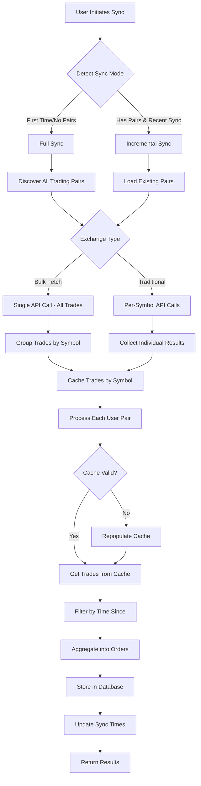
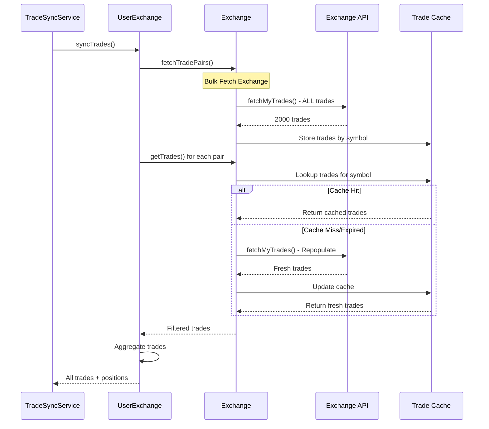
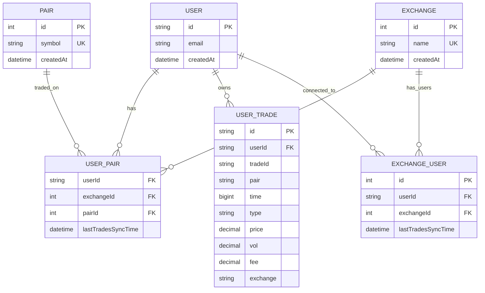
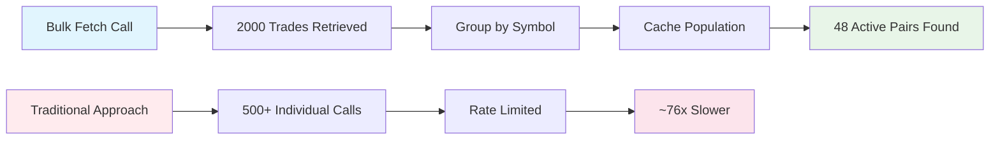
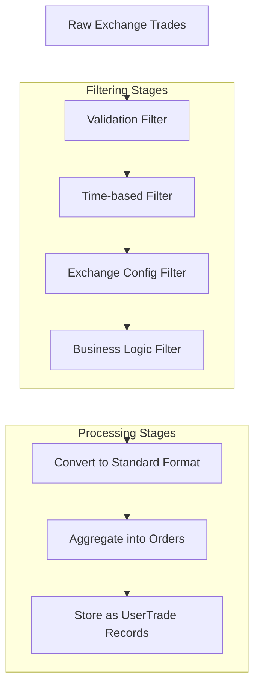

# Trade Synchronization System

## Overview

The Trade Synchronization System is a comprehensive solution for fetching, caching, and storing cryptocurrency trades from multiple exchanges. It supports both bulk fetch optimization for high-performance exchanges and traditional per-symbol fetching for standard exchanges.

## Architecture Components

### Core Classes

1. **TradeSyncService** - Main orchestrator for sync operations
2. **UserExchange** - User-specific exchange management and trade aggregation
3. **Exchange** - Individual exchange wrapper with caching capabilities
4. **UserExchangeRepository** - Database operations for user pairs and sync times

### Key Features

- **Bulk Fetch Optimization**: Single API call fetches all trades for supported exchanges
- **Intelligent Caching**: 30-minute cache duration with automatic repopulation
- **Incremental Sync**: Only fetches new trades since last sync
- **Multi-Exchange Support**: Unified interface for different exchange APIs
- **Trade Aggregation**: Combines individual trades into orders and positions

## Exchange Capabilities

### Bulk Fetch Exchanges
- **Hyperliquid**: Supports fetching all trades in single API call
- **Performance**: ~76x faster than individual symbol calls
- **Cache Strategy**: Groups trades by symbol for instant lookup

### Traditional Exchanges
- **Binance, Kraken, Bybit**: Per-symbol trade fetching
- **Rate Limiting**: Configurable delays between API calls
- **Futures Filtering**: Automatic filtering of futures symbols

## Sync Flow Diagram



## Caching Strategy

### Cache Structure
```typescript
private cachedTradesBySymbol: Map<string, CCxtTrade[]>
private cacheTimestamp: number
private readonly CACHE_DURATION = 30 * 60 * 1000 // 30 minutes
```

### Cache Lifecycle



## Database Schema Integration

### Key Tables



## Sync Process Details

### 1. Sync Mode Detection

```typescript
private async detectSyncMode(userId: string): Promise<'full' | 'incremental'> {
  const existingPairs = await this.userExchangeRepository.findUserPairs(userId);
  const lastSync = await this.userExchangeRepository.getLastSyncTimes(userId);
  
  const hasPairs = Object.keys(existingPairs).length > 0;
  const hasRecentSync = lastSync && Object.keys(lastSync).length > 0;
  
  return (!hasPairs || !hasRecentSync) ? 'full' : 'incremental';
}
```

### 2. Bulk Fetch Optimization



### 3. Trade Processing Pipeline



## Performance Optimizations

### Bulk Fetch Benefits
- **API Efficiency**: 1 call vs 500+ calls
- **Rate Limit Avoidance**: No per-symbol rate limiting
- **Cache Optimization**: Single cache population
- **Performance Gain**: ~76x faster than traditional approach

### Cache Management
- **Duration**: 30 minutes to handle sync delays
- **Repopulation**: Automatic cache refresh on expiry
- **Symbol Matching**: Intelligent partial matching for lookups
- **Memory Efficient**: Map-based storage with trade grouping

## Error Handling and Recovery

### Cache Failures
```typescript
// Automatic cache repopulation
if (supportsBulkFetch(this.id) && !this.isCacheValid() && market) {
  await this.fetchAllTradesAndGroupBySymbol(since);
  return await this.processTradesFromCache(market, since);
}
```

### Symbol Mismatch Detection
```typescript
// Partial symbol matching for debugging
const partialMatches = availableSymbols.filter(symbol => 
  symbol.includes(market) || 
  market.includes(symbol.split('/')[0]) || 
  market.includes(symbol.split(':')[0])
);
```

## Configuration

### Exchange Capabilities
```typescript
// exchangeCapabilities.ts
export const exchangeCapabilities = {
  hyperliquid: {
    supportsBulkFetch: true,
    supportsSymbolFiltering: false,
    rateLimit: 100,
    maxTradesPerCall: 2000
  },
  binance: {
    supportsBulkFetch: false,
    supportsSymbolFiltering: true,
    rateLimit: 1200,
    maxTradesPerCall: 1000
  }
};
```

### Filter Configuration
```typescript
// filterConfig.ts
export const filterConfig = {
  hyperliquid: {
    minTradeAmount: 0.001,
    requireTimestamp: true,
    requireTradeId: true,
    customFilter: (trade) => !trade.info?.isLiquidation
  }
};
```

## API Endpoints

### Sync Trades
```typescript
// tRPC endpoint
syncTrades: protectedProcedure
  .input(z.object({
    mode: z.enum(['full', 'incremental']).optional(),
    since: z.number().optional()
  }))
  .mutation(async ({ input, ctx }) => {
    return await tradeSyncService.syncTrades(
      ctx.session.user.id,
      ctx.session.encryptedKeys,
      input.mode,
      input.since
    );
  });
```

## Monitoring and Debugging

### Performance Metrics
- **Sync Duration**: Total time for complete sync
- **Cache Hit Rate**: Percentage of successful cache lookups
- **Trade Processing Rate**: Trades processed per second
- **API Call Efficiency**: Bulk vs individual call ratios

### Debug Logging
- **Cache Validation**: Detailed cache state information
- **Symbol Matching**: Exact symbol comparisons
- **Trade Filtering**: Stage-by-stage filtering statistics
- **Performance Timing**: Detailed timing for each operation

## Troubleshooting

### Common Issues

1. **Zero Trades Found**
   - Check cache validity and symbol format matching
   - Verify exchange API permissions
   - Review time-based filtering parameters

2. **Cache Misses**
   - Ensure cache duration is sufficient
   - Check for symbol format differences
   - Verify cache repopulation logic

3. **Performance Issues**
   - Confirm bulk fetch is enabled for supported exchanges
   - Check rate limiting configurations
   - Review filtering efficiency

### Debug Commands

```bash
# Check cache statistics
exchange.getCacheStats()

# Force cache repopulation
exchange.clearCache()

# Manual symbol verification
exchange.loadSymbols()
```

## Future Enhancements

### Planned Features
- **Real-time Sync**: WebSocket-based live trade updates
- **Advanced Filtering**: ML-based trade classification
- **Cross-Exchange Arbitrage**: Multi-exchange position tracking
- **Performance Analytics**: Detailed sync performance metrics

### Scalability Considerations
- **Horizontal Scaling**: Multi-instance cache coordination
- **Database Optimization**: Partitioned trade storage
- **API Rate Management**: Dynamic rate limiting adaptation
- **Memory Management**: Configurable cache size limits

## Conclusion

The Trade Synchronization System provides a robust, high-performance solution for cryptocurrency trade management. Its intelligent caching strategy, bulk fetch optimization, and comprehensive error handling ensure reliable operation across multiple exchanges while maintaining excellent performance characteristics.